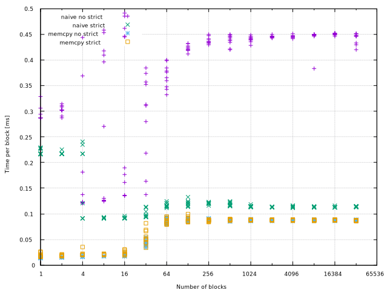
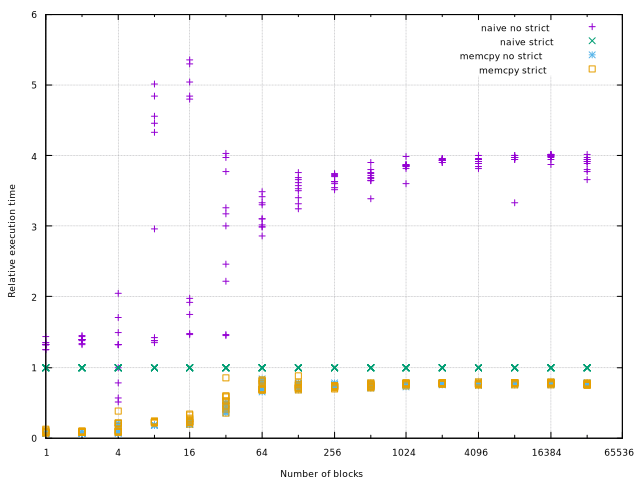

# StrictAliasing in C++

Towards an understanding of the strict aliasing rules.


## Introduction

It has become clear to me that I do not understand the strict aliasing rules.
This text is an exploration into the standards, articles, blog posts, and
compiler output that describe when and where we are allowed to break the strict
aliasing rule.

The rules for C and C++ are different and I will be focusing on C++.

Assembly output shown in this text has been generated on Matt Godbolt's [Compiler
Explorer](https://godbolt.org) using Clang 5.0 and GCC 7.2 targeting x86_64,
compiled with `-O3 -std=c++14 -fstrict-aliasing -Wstrict-aliasing` unless
otherwise specified.

Let's start with the basics. The strict aliasing rule state that a program may
not access a memory location as two different types. For example, if some
collection of bits in memory hold a floating point value then we may not access
those bits as an integer. Makes sence, but the question is; what makes two types
different? And there are also exceptions we need to consider.

The wording used by [the standard draft](http://eel.is/c++draft/basic.lval#8) is

> If a program attempts to access the stored value of an object through a
glvalue of other than one of the following types the behavior is undefined:

And then follows a list of cases that will be detailed in this text. The "stored
value" part will become important later.


## Assembly primer

This text uses AT&T syntax. Registers are prefixed with `%`. Registers staring
with `%r` are 64 bit registers and registers starting with `%e` are 32 bit
registers. The lower 32 bits of an `%r` register IS the corresponding `%e`
register. A register with neither `r` nor `e` is a 16 bit or 8 bit register.

Integer and pointer arguments are passed in `%rdi`, `%rsi`, `%rdx`, `%rcx`,
`%r8`, and `%r9`. Floating point arguments are passed in `%xmm0` to `%xmm7`.
Return values from functions are stored in `%rax`. The special register `%rsp`
is the stack pointer. The current stack frame's data is stored in addresses
lower than where `%rsp` points.

Memory is addressed using `(<base>,<index>,<step_size>)` where `<base>` marks
the start of an array, `<index>` is the index in the array to access, and
`<step_size>` is the size in bytes of the array elements. For example,
`(%rdi,%rsi,4)` accesses the `%rsi`th 4-byte element in an array starting at
`%rdi`. Example code that could produce this memory access is

```c++
float array_lookup(float* data, uint64_t index) {
    return data[index];
}
```

Simpler forms of memory addressing exists as well. If we have a pointer directly
to the data then we can access it by `(<pointer>)`. An example is `(%rdi)`. If
we have a pointer to a struct or class and want to access a member variable then
we can use the `<byte_offset>(<pointer>)` adressing mode. To read the member `f` in

```c++
struct Data {
  uint32_t i;
  float f;
  float get_f() { return this->f;}
};
```

from a member function the compiler would insert a load of `4(%rdi)`. Remember
that `%rdi` holds the first argument passed to a function. The compiler passes the
`this` pointer as a hidden first argument. `4(%rdi)` hence loads whatever can be
found 4 bytes into the structure, which skips past the width of one `uint32_t`.

[Understanding C by learning assembly](https://www.recurse.com/blog/7-understanding-c-by-learning-assembly)
by David Albert is a longer introduction to reading assembly.

## Simple examples

Finding a simple, but still realistic, example that actually miscompiles has
turned out to be more difficult than I expected. I believe all of these break
the strict aliasing rule.


### Swap halves

This is a classical example, taken from Mike Acton's [_Understanding strict
aliasing_](http://cellperformance.beyond3d.com/articles/2006/06/understanding-strict-aliasing.html)
article on CellPerformance, slightly altered to account for x86_64 being
little-endian and PowerPC being big-endian.

```c++
 uint32_t
 swap_words(uint32_t arg)
 {
   uint16_t* const sp = (uint16_t*)&arg;
   uint16_t        lo = sp[0];
   uint16_t        hi = sp[1];

   sp[1] = lo;
   sp[0] = hi;

   return arg;
 }
```

Here we construct an `uint16_t*` that points to memory that holds an `uint32_t`.
We then both read and write that memory through the wrongly typed pointer. At
the end we return the supposedly modified `uint32_t` value. Since no write
happens to or through something that is an `uint32_t`, the compiler is allowed
to return `arg` unmodified.

Neither Clang nor GCC does, however:

Clang:
```c++
swap_words(uint32_t):
  roll $16, %edi
  movl %edi, %eax
  retq
```

The argument is passed in `%rdi` and the `roll` instructions rotates the bits to
the left by 16, which is half of 32, which results in the two halves being
swapped. Finally the rotated value is moved to `%eax`, which is where the
calling function expects the return value.


GCC:
```c++
swap_words(uint32_t):
  movl %edi, %eax
  movw %di, -2(%rsp)
  shrl $16, %eax
  movw %ax, -4(%rsp)
  movl -4(%rsp), %eax
  ret
```

GCC has a different approach. It writes the lower half of the argument, i.e.,
`%di`, to the stack, shifts the upper half of the value right, or down, by 16
bits and writes those to the stack as well, but on the "wrong side". An
`uint32_t` with the halves swapped have now been created on the stack it is read
back into `%eax` for the return.


### Extract exponent

This piece of code extracts the exponent bits from a 32-bit floating point
number. It does so by shifting the exponent bits down to the bottom and then
masking away the sign bit.

```c++
uint32_t extract_exponent(float value) {
    uint32_t bits = *(uint32_t*)&value;
    uint32_t exponent_and_sign = bits >> 23;
    uint32_t exponent = exponent_and_sign & ~(1<<8);
    return exponent;
}
```


Clang:
```c++
extract_exponent(float): # @extract_exponent(float)
  movd %xmm0, %eax
  shrl $23, %eax
  movzbl %al, %eax
  retq
```

The Clang version moves the float from `%xmm0` to `%eax` and then shifts the
sign and exponent bits down to the lowest bit positions. It then does the
masking away of the sign bit by zero-extending `%al`, which now holds the eight
exponent bits, into the full register.

GCC:
```c++
extract_exponent(float):
  movd %xmm0, %eax
  shrl $23, %eax
  andb $-2, %ah
  ret
```

GCC starts off in the same way, but does the sign bit masking by and-ing the
second byte of `%eax`, `%ah`, with `-2`, which is encoded as `1111'1110`. The
zero there aligns up with the sign bit at bit 9 of `%eax`.


### Read, write, read

This is an example where Clang and GCC generates code that will produce different
results.

```c++
uint32_t read_write_read(uint32_t* i, float* f) {
    uint32_t v = *i;
    *f = 1.0;
    return *i;
}
```

Clang:
```c++
read_write_read(unsigned int*, float*):
  movl $1065353216, (%rsi) # imm = 0x3F800000
  movl (%rdi), %eax
  retq
```

GCC:
```c++
read_write_read(unsigned int*, float*):
  movl (%rdi), %eax
  movl $0x3f800000, (%rsi)
  ret
```

Where Clang first writes to the `float*` and then reads from the `uint32_t*`, GCC
does it in the opposite order. If both pointers point to the same memory then
Clang will return 1065353216, the integer value of the bit pattern for 1.0f, and
GCC will return whatever integer was at that memory location originally.


## Vector set

This example demonstrates the benefit of enforcing the strict aliasing rule.

```c++
class Vector
{
private:
    float* data;
    uint64_t size;
public:
    void set(float value)
    {
      for (uint64_t i = 0; i < this->size; ++i)
      {
          data[i] = value;
      }
    }
};
```

With `-fstrict-aliasing`:
```c++
Vector::set(float): # @Vector::set(float)
  movq 8(%rdi), %r8   // Load the size of the vector.
  testq %r8, %r8      // Early out if
  je .LBB6_4          // size == 0.
  movq (%rdi), %rcx   // Load the float*.
  xorl %edx, %edx     // i = 0.
.LBB6_3: # =>This Inner Loop Header: Depth=1
  movss %xmm0, (%rcx,%rdx,4) // Store the argument to data[i].
  incq %rdx           // ++i.
  cmpq %r8, %rdx      // if i < size:
  jb .LBB6_3          //   Jump back up.
.LBB6_4:
  retq
```

The generated code follows the C++ code pretty much statement for statement.
Let's compare with what one get when strict aliasing is disabled.


With `-fno-strict-aliasing`:
```c++
Vector::set(float): # @Vector::set(float)
  cmpq $0, 8(%rdi) // Check the size of the vector.
  je .LBB6_3       // Early out if empty.
  xorl %eax, %eax  // i = 0.
.LBB6_2: # =>This Inner Loop Header: Depth=1
  movq (%rdi), %rcx           // Load the float*.
  movss %xmm0, (%rcx,%rax,4)  // Store the argument to data[i].
  incq %rax                   // ++i.
  cmpq 8(%rdi), %rax          // if i < size:
  jb .LBB6_2                  //    Jump back up
.LBB6_3:
  retq
```

Notice that the sequence of instructions is very similar to the previous
listing, but here nothing is cached in registers. Every time we need the
`float*` or the number of elements we load from memory via `%rdi`, the `this`
pointer. This is because the compiler must assume that `movss %xmm0,
(%rcx,%rax,4)`, the assignment to `data[i]`, may write to any writable part of
memory. Including the `Vector` instance itself. If the C++ code is allowed to
make any pointer point to any available memory regardless of their respective
types then we could do something like the following.

```c++
Vector v;
v.size = 16;
v.data = (float*)(&v - 2);
v.set(fabricated_float);
```

If an outsider has control over `fabricated_float` then the outsider can cause
`Vector::set` to write those four bytes to anywhere in memory since the outsider
will have control over what `v.data` will point to after it has been
overwritten. This is a security hole just waiting for someone to come and poke
at it.

In short, the type system is there for a reason. Please don't subvert it by
casting one type of pointer into another.

But wait, there's more. The `-fstrict-aliasing` version shown first was just a
snippet. If the compiler can know that the write done by one iteration will have
no influence on preceeding or succeeding iterations it can do all kinds of
trickery to make the loop go faster for large arrays. For example unroll the
loop and use SSE instructions to set 64 floats per iteration, as shown below.
Or 128 floats if you have an AVX capable compiler and CPU.

In the below there is talk about aligned floats. In this case I do not mean that
the floats' addresses in memory are aligned, but that _the number of floats_ is
aligned to some number suitable for efficient SIMD execution. That is, the
number of floats not counting any stragglers that will need to be handled in a
clean-up loop after the main SIMD loop is done.

With `-fstrict-aliasing`:
```c++
Vector::set(float): # @Vector::set(float)
  movq 8(%rdi), %r8  // Load size.
  testq %r8, %r8     // Check if empty.
  je .LBB6_12        // Early out if empty.
  movq (%rdi), %rcx  // Load float*.
  cmpq $7, %r8       // Check if we have more than 7 floats.
  ja .LBB6_3         // If so, jump to unrolled loop selection.
  xorl %edx, %edx    // i = 0.
  jmp .LBB6_11       // Jump to short-array version. The one shown previously.
.LBB6_3:
  movq %r8, %rdx       // Copy size to %rdx.
  andq $-8, %rdx       // Align size down to multiple of 8.
  movaps %xmm0, %xmm1  // Copy parameter to %xmm1.
  shufps $0, %xmm1, %xmm1 # xmm1 = xmm1[0,0,0,0] // Splat to all SIMD lanes of %xmm1.
  leaq -8(%rdx), %rax  // %rax = aligned_size - 8.
  movq %rax, %rdi      // Throw away 'this' pointer. Don't need it any more.
  shrq $3, %rdi        // Divide aligned_size by 8...
  leal 1(%rdi), %esi   // ...and add 1...
  andl $7, %esi        // ...and align down to multiple of 8 again. Not sure what all this produces.
  cmpq $56, %rax       // Do we have 56 or more aligned elements?
  jae .LBB6_5          //   If so, jump to more unrolled loop.
  xorl %edi, %edi      // If not:
  testq %rsi, %rsi     //    Do we have any aligned elements at all?
  jne .LBB6_8          //      If so, jump to less unrolled loop.
  jmp .LBB6_10         //      If not, jump to scalar copy loop.
.LBB6_5:
  leaq -1(%rsi), %rax  // Here is where we get if we had 56 or more aligned floats.
  subq %rdi, %rax      // Set up a few loop counters. To be honest I'm
  xorl %edi, %edi      // not entirely sure what's going on here.
.LBB6_6: # =>This Inner Loop Header: Depth=1
  movups %xmm1, (%rcx,%rdi,4)     // A whole bunch of SSE writes to memory.
  movups %xmm1, 16(%rcx,%rdi,4)
  movups %xmm1, 32(%rcx,%rdi,4)
  movups %xmm1, 48(%rcx,%rdi,4)
  movups %xmm1, 64(%rcx,%rdi,4)
  movups %xmm1, 80(%rcx,%rdi,4)
  movups %xmm1, 96(%rcx,%rdi,4)
  movups %xmm1, 112(%rcx,%rdi,4)
  movups %xmm1, 128(%rcx,%rdi,4)
  movups %xmm1, 144(%rcx,%rdi,4)
  movups %xmm1, 160(%rcx,%rdi,4)
  movups %xmm1, 176(%rcx,%rdi,4)
  movups %xmm1, 192(%rcx,%rdi,4)
  movups %xmm1, 208(%rcx,%rdi,4)
  movups %xmm1, 224(%rcx,%rdi,4)
  movups %xmm1, 240(%rcx,%rdi,4)
  addq $64, %rdi    // i += 64.
  addq $8, %rax     // Why add 8 here?
  jne .LBB6_6       // Why would %rax become 0 when we're done?
  testq %rsi, %rsi  // That is what's tested here, right?
  je .LBB6_10   // Done with massively parallel part, jump to clean-up loop.
.LBB6_8: // Here is where we get if we had less than 56 aligned floats.
  leaq 16(%rcx,%rdi,4), %rax // Don't know what
  negq %rsi                  // these two does.
.LBB6_9: # =>This Inner Loop Header: Depth=1 // Loop with fewer unrolled iterations.
  movups %xmm1, -16(%rax) // Loop that
  movups %xmm1, (%rax)    // writes 8
  addq $32, %rax          // elements per
  incq %rsi               // iteration.
  jne .LBB6_9
.LBB6_10:         // Here is where we get if we have no aligned floats.
  cmpq %rdx, %r8
  je .LBB6_12
.LBB6_11: # =>This Inner Loop Header: Depth=1
  movss %xmm0, (%rcx,%rdx,4) // Store a float.
  incq %rdx                  // ++i.
  cmpq %r8, %rdx             // if i < size:
  jb .LBB6_11                //    Jump back up.
.LBB6_12:
  retq
```


### Blocked reorder

Here is a considerably more complicated example where the benefit of the strict
aliasing rule is demonstrated. The goal of this code is to reorder a set of
blocks of data, let's say that they are blocks in a sparse blocked matrix,
according to the permutation given as a set of source-distination indices.
Perhaps we want to optimize the storage for cache locality reasons, or perhaps
we want to create a block-transposed version of the matrix.

`src` contains the data we want to reorder and `dst` is the memory where we want
to place the reordered result. For each block, `src_block_start` and
`dst_block_start` contains an entry holding the start of that block in the `src`
and `dst` arrays; and `block_size` contains the number of floating points values
in that block.

The following statements may help you understand the relationship between the arguments.
- `src` and `dst` point to `float` arrays with an equal number of elements.
- `src_block_starts`, `dst_block_starts`, and `block_sizes` point to `uint32_t` arrays with an equal number of elements.
- `src_block_starts`, `dst_block_starts`, and `block_sizes` all contain `num_blocks` elements.
- The sum of all `uint32_t`s in `block_sizes` is equal to the number of `float`s in `src` and `dst`.
- The range [`src_block_starts[i]`, `src_block_starts[i]+block_sizes[i]`) for block `i` does not overlap the corresponding range for any other block.
- The range [`dst_block_starts[i]`, `dst_block_starts[i]+block_sizes[i]`) for block `i` does not overlap the corresponding range for any other block.
- No such range extend beyond the size of `src` or `dst`.
- A loop over the blocks in `src_block_starts` / `block_sizes` may visit the blocks in `src` in any order.
- A loop over the blocks in `dst_block_starts` / `block_sizes` may visit the blocks in `dst` in any order.
- A loop over the blocks in `src_block_starts` / `block_sizes` will visit each block in `src` exactly once.
- A loop over the blocks in `dst_block_starts` / `block_sizes` will visit each block in `dst` exactly once.

The block copying is probably best done using a call to `memcpy`, but let's
pretend that we're affraid of the performance cost of a function call.

```c++
void blocked_reorder(
    float* src,
    float* dst,
    uint32_t* src_block_starts,
    uint32_t* dst_block_starts,
    uint32_t* block_sizes,
    uint32_t num_blocks)
{
    for (uint32_t block_idx = 0; block_idx < num_blocks; ++block_idx) {
        for (uint32_t elem_idx = 0; elem_idx < block_sizes[block_idx]; ++elem_idx) {
            uint32_t src_start = src_block_starts[block_idx];
            uint32_t dst_start = dst_block_starts[block_idx];
            float f = src[src_start + elem_idx];
            dst[dst_start + elem_idx] = f;
        }
    }
}
```

What we would like the optimizer to do is to store `src_start`, `dst_start`, and
the block size in registers while copying a block instead of reloading it from
the array for every float. Passing `-O3` produces quite a bit of code for this
function, so `-Os` is used instead.

First the version without strict aliasing, i.e., with `-fno-strict-aliasing`:

Clang:
```c++
blocked_reorder(
    float* src, // rdi
    float* dst, // rsi
    unsigned int* src_block_starts, // rdx
    unsigned int* dst_block_starts, // rcx
    unsigned int* block_sizes,      // r8
    unsigned int num_blocks):       // r9

  pushq %rbx // Store callee-saved register we will be using.

  testl %r9d, %r9d  // Exit immediately
  je .LBB8_6        // if num_blocks == 0.

  movl %r9d, %r9d   // Not sure what this is. Sometimes we move a register to
                    // itself to make sure the upper bits are set to zero, but
                    // it can also be used as a sized NOP to align the instruction
                    // stream for jump targets.

  xorl %r10d, %r10d // Set r10 to 0. This is block_idx.

  // This is the top of the block_idx loop.
.LBB8_2: # =>This Loop Header: Depth=1
  cmpl $0, (%r8,%r10,4) // Check if block_sizes[block_idx] is zero.
  je .LBB8_5            // Go to the next iteration if it is.

  xorl %r11d, %r11d  // Set r11 to 0. This is elem_idx.

  // This is the top of the elem_idx loop.
.LBB8_4: # Parent Loop BB8_2 Depth=1

  // Load and element from src.
  movl (%rdx,%r10,4), %eax // Load src_block_start[block_idx] into eax.
  addl %r11d, %eax         // Add elem_idx to eax.
  movl (%rdi,%rax,4), %eax // Load src[elem_idx + src_start[block_idx]] into eax.

  // Load an element from dst.
  movl (%rcx,%r10,4), %ebx // Load dst_block_start[block_idx] into ebx.
  addl %r11d, %ebx         // Add elem_idx to ebx.
  movl %eax, (%rsi,%rbx,4) // store eax, the value read from src, to dst[elem_idx + dst_block_start[block_idx]].

  // Inner loop postamble.
  incl %r11d               // ++elem_idx.
  cmpl (%r8,%r10,4), %r11d // elem_idx < block_sizes[block_idx].
  jb .LBB8_4               // Jump back up if there are more elements in this block.

  // Outer loop postamble.
.LBB8_5: # in Loop: Header=BB8_2 Depth=1
  incq %r10       // ++block_idx.
  cmpq %r9, %r10  // block_idx < num_blocks.
  jne .LBB8_2     // Jump back up if there are more blocks.

  // Return.
.LBB8_6:
  popq %rbx
  retq
```

The element copying loop, the part that could have been a call to `memcpy`, is
between the `LBB8_4` and `LBB8_5` jump labels. It contains five memory
references per copied float.

Now let's have a look at the version compiled with `-fstrict-aliasing`.

```c++
blocked_reorder(
    float* src, rdi
    float* dst, rsi
    unsigned int* src_block_starts, rdx
    unsigned int* dst_block_starts, rcx
    unsigned int* block_sizes, r8
    unsigned int num_blocks): r9

  // Stack management. There are a lot more registers being used this time.
  pushq %rbp
  pushq %r15
  pushq %r14
  pushq %rbx

  testl %r9d, %r9d // Return immediately if there
  je .LBB9_6       // are no blocks.

  movl %r9d, %r9d    // Zero extend or align instruction stream.

  xorl %r10d, %r10d // block_idx = 0.

  // This is the top of the block_idx loop.
.LBB9_2: # =>This Loop Header: Depth=1
  movl (%r8,%r10,4), %r11d  // Load block_size[block_idx].
  testq %r11, %r11          // Skip this iteration is the block is empty.
  je .LBB9_5

  movl (%rcx,%r10,4), %r14d // Load dst_block_starts[block_idx]. Let's call it dst_start.
  movl (%rdx,%r10,4), %r15d // Load src_block_starts[block_idx]. Let's call it src_start.
  xorl %eax, %eax           // elem_idx = 0.

  // This is the top of the elem_idx loop.
.LBB9_4: # Parent Loop BB9_2 Depth=1
  leal (%r15,%rax), %ebx   // Compute src_start + elem_idx.
  movl (%rdi,%rbx,4), %ebp // Load src[src_start + elem_idx].
  leal (%r14,%rax), %ebx   // Compute dst_start + elem_idx.
  movl %ebp, (%rsi,%rbx,4) // Store loaded value to dst[dst_start + elem_idx].

  // Inner loop postamble.
  incq %rax       // ++elem_idx.
  cmpq %r11, %rax // elem_idx < block_size[block_idx].
  jb .LBB9_4      // Jump back up if there are more more elements in this block.

  // Outer loop postamble.
.LBB9_5: # in Loop: Header=BB9_2 Depth=1
  incq %r10      // ++block_idx.
  cmpq %r9, %r10 // block_idx < num_blocks.
  jne .LBB9_2    // Jump back up if more blocks.

  // Return
.LBB9_6:
  popq %rbx
  popq %r14
  popq %r15
  popq %rbp
  retq
```

In this case the inner loop contains only two memory references per iteration.

Let's do some measurements. The image below graph the runtime for ten random
reorderings of an increasing number of blocks, with each block containing 30,000
floats, using a log2-log2 scale.






## Resources

[C++ standard draft](http://eel.is/c++draft)
[What is the strict aliasing rule?, StackOverflow](https://stackoverflow.com/questions/98650/what-is-the-strict-aliasing-rule)
[Understanding strict aliasing](http://cellperformance.beyond3d.com/articles/2006/06/understanding-strict-aliasing.html)
[Compiler Explorer](https://godbolt.org)
[Understanding C by learning assembly](https://www.recurse.com/blog/7-understanding-c-by-learning-assembly)